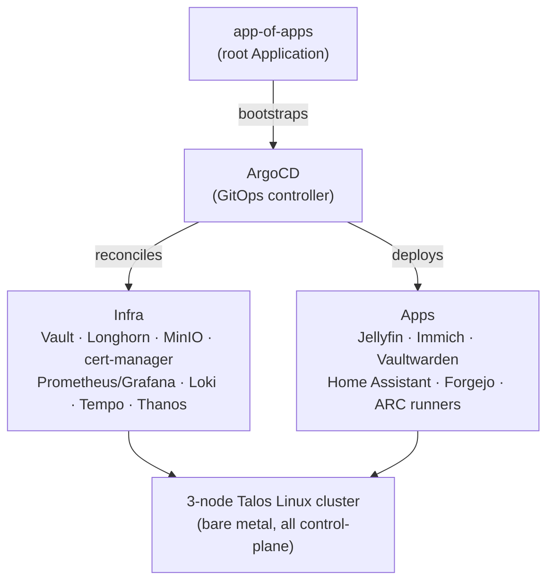

# 🚀 Jack Harter | Trailblazer of Strange Worlds

**DevOps / Linux Engineer • Cloud-Native Polyglot • Homelab Hooplehead**

I thrive in the weird and wild corners of the tech world. To me, computing is about the natural curiosity of how things work — and how they can be made better. From orchestrating container lifecycles to hardening network firewalls, I build resilient digital ecosystems that bridge the gaps between scripts, hardware, ML, and automation.

📍 Cook County, IL &nbsp;·&nbsp; 🌐 [j.hartr.net](https://j.hartr.net) &nbsp;·&nbsp; 🔗 [Linktree](https://linktr.ee/jackharter)

<picture>
  <source media="(prefers-color-scheme: dark)" srcset="https://raw.githubusercontent.com/jharter1/jharter1/output/github-contribution-grid-snake-dark.svg" />
  <source media="(prefers-color-scheme: light)" srcset="https://raw.githubusercontent.com/jharter1/jharter1/output/github-contribution-grid-snake.svg" />
  
</picture>

---

### 🔭 Currently
* Wiring **Atlantis** into the homelab for GitOps'd Terraform plan/apply straight from PR comments
* Hardening DNS with **Pi-hole + Unbound** as a local recursive resolver — no more upstream dependency
* Standing up a **Tailscale exit node** and a network-overview Grafana dashboard
* Tracking homelab spend with **OpenCost**

---

### 🛠️ Professional & Cloud-Native Stack

### 🏠 Home Lab Stack

🗺️ Home Lab Architecture

---

### 📌 Featured Projects

| Project | What it is |
|---|---|
| 🐢 **Talos K8s Homelab** *(private)* | 3-node, all-control-plane Talos Linux Kubernetes cluster, bare metal. GitOps'd through a single ArgoCD app-of-apps reconciling ~30 infra components (Longhorn, Vault, cert-manager, Prometheus/Grafana/Loki/Tempo/Thanos) and ~20 self-hosted apps (Jellyfin, Immich, Vaultwarden, Home Assistant, self-hosted CI runners via ARC). |
| ☁️ **[argocd-gke-cost-optimized](https://github.com/jharter1/argocd-gke-cost-optimized)** | Cost-optimized ArgoCD deployment on GKE using Terraform and NGINX ingress. |
| 🏗️ **[hashi_homelab](https://github.com/jharter1/hashi_homelab)** | Predecessor stack — Packer-built Debian templates, Terraform-provisioned Nomad/Consul cluster, Vault, and a Prometheus + Grafana + Loki observability stack on Proxmox VE. |
| ⚙️ **[hashi-homelab-ansible](https://github.com/jharter1/hashi-homelab-ansible)** | Ansible roles that configured and maintained the Nomad-era homelab cluster. |
| 🖥️ **[jharter1.github.io](https://github.com/jharter1/jharter1.github.io)** | My Jekyll-based portfolio site at [j.hartr.net](https://j.hartr.net) — theme-aware, WCAG 2.1 AA compliant, with an automated PR review workflow. |
| 🔩 **[configs](https://github.com/jharter1/configs)** | Dotfiles and system configs I keep sharp and reproducible across machines. |

### 🛰️ Recent Expeditions
* **The Great Migration:** Tore down the Nomad/Proxmox stack and rebuilt as a 3-node, all-control-plane Talos Linux Kubernetes cluster — no SSH, no package manager, fully declarative machine config.
* **One App-of-Apps to Rule Them All:** GitOps'd the entire homelab through a single ArgoCD root Application, reconciling everything from Longhorn and Vault to Jellyfin, Immich, and self-hosted CI runners.
* **Cost-Conscious Cloud-Native:** Shipping `argocd-gke-cost-optimized`, a leaner ArgoCD-on-GKE pattern using Terraform and NGINX ingress instead of pricier managed defaults.
* **Network Hardening:** Deep-diving into firewall resilience to create a fort for cloud and self-hosted services.
* **Artifact Musing:** Digging into the elder magick — Unix, Vim, Bash, Git, and the unforgiving edges that keep us connected.

### ⚙️ The Configs (Dotfiles)
I believe in keeping my tools sharp and my environments reproducible. You can find my system configurations here:
👉 **[jharter1/configs](https://github.com/jharter1/configs)** — *Where the hacky meets the refined.*

---

### 🧠 Perspective & Philosophy
I'm inspired by the pioneers who viewed computing as a tool for human progress and a playground for the mind.
* **Resilience:** Building systems that survive the chaos of digital gremlins and physical disasters.
* **Security:** Implementing secrets management because "good enough" isn't quite good, or enough.
* **The Hacker Ethic:** Pursuing technical elegance not for the sake of the market, but for the sake of the craft.

---

### 🤝 Let's Connect
I'm always open to chatting about cloud-native patterns, homelab hardware, or the best Midwestern craft brews.

**Based in Cook County, IL.** If you're in town, let's grab a beer, a coffee, or hit the trail for a run.

* 🌐 **[Portfolio](https://j.hartr.net)** — Case studies, write-ups, and the long version of all this.
* 🔗 **[Linktree](https://linktr.ee/jackharter)** — Socials, contact, and more.
* 🏗️ **Status:** Open to collaboration on open-source projects or networking architecture.

---

### ⚡ The "Secret Sauce"
> **Fun Fact:** My current production stack is a 3-node Talos Linux Kubernetes cluster — all control-plane, no SSH, no package manager, config or nothing — running on the same trio of Lenovo ThinkCentre micros. One ArgoCD app-of-apps bootstraps the whole thing and reconciles ~30 downstream apps, from Longhorn and Vault to Jellyfin, Immich, and Home Assistant. It used to live on an M1 Mac Mini, then moved to Nomad on Proxmox — now it's fully GitOps'd, immutable-OS Kubernetes. Progress, mostly.
